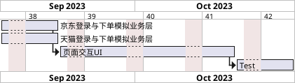

# miaosha

**简介**
miaoshi 是基于京东&天猫的商品秒杀工具。
用户可以根据实际情况设置定期任务，也可以根据需要设置单一任务。

**截止2023年9月中旬项目未完成工作进度计划**

目前仅实现了京东的自动化运行逻辑。
在使用时，注意需要自己修改几个信息：
1. app.py文件中的账号和密码信息
2. 下载chrome和与chrome版本相匹配的chromedriver文件。
3. 修改task_config.py文件中的default_chrome_path 和 default_chrome_drive_path。项目中，是配置的mac系统环境。使用者需要根据实际系统修改一下。
